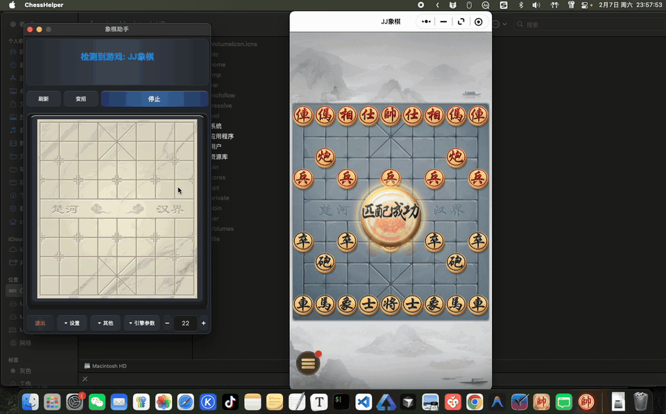
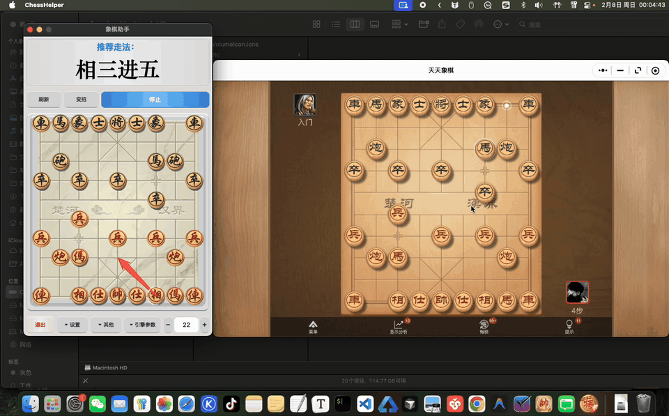

# 象棋助手 (Chess Helper)

一款智能的中国象棋辅助工具，支持微信小程序平台 **JJ象棋** 和 **天天象棋** 直接使用，无需使用改造的官方客户端，无封号风险。利用计算机视觉技术和强大的Pikafish象棋引擎，为您提供实时的局势分析与着法推荐。

---

## 📸 功能演示 (Demo)

### 自动识别与实时分析
程序能够自动检测游戏窗口，精准定位棋盘，并实时显示最佳着法路线。

计算速度快，引擎参数可调。

---

## ✨ 主要功能 (Key Features)

-   **🤖 全自动平台检测**:
    -   无需手动选择，自动识别当前运行的游戏（支持 JJ象棋、天天象棋）。
    -   支持断线重连，游戏重启后自动恢复分析。

-   **🎯 动态棋盘定位**:
    -   **4K/Retina 支持**: 完美适配高分辨率屏幕，坐标识别精准。
    -   **智能跟随**: 窗口移动或缩放时，自动计算新的棋盘区域，无需人工干预。
    -   **抗干扰**: 采用霍夫圆变换与颜色过滤算法，排除背景干扰，精准锁定棋子。

-   **💡 强大引擎内核**:
    -   内置高性能 **Pikafish** 象棋引擎。
    -   支持 **深度优先**与**时间优先**两种分析模式。
    -   可自定义思考层数与时间限制，满足不同场景需求。

-   **🛡️ 稳健运行**:
    -   **防误触机制**: 智能识别结算画面与异常遮挡，避免错误着法推荐。
    -   **多线程架构**: 界面流畅，分析过程不卡顿。

---

## 🛠️ 安装与使用 (Installation & Usage)

### 环境要求
-   macOS 12+ (支持 Intel 与 Apple Silicon)
-   Python 3.10+

### 快速开始
-   下载安装客户端dmg文件

### 自行编译
-   若有兴趣和技术能力，可以参考Pikafish开源引擎文档，自行编译Windows平台的引擎文件：https://github.com/official-pikafish/Pikafish
-   将编译好的引擎文件中的src目录放入本项目`chess-helper-app/app/Pikafish`目录下
-   下载本项目，安装依赖，执行`pip install -r requirements.txt`
-   运行`python app/main.py`即可使用
-   如有需要，可以使用`pyinstaller ChessHelper.spec --noconfirm`打包客户端

---

## 🤝 贡献与反馈
欢迎提交 Issue 或 Pull Request 来帮助改进这个项目！

## 📄 许可证
本项目采用 Mulan PSL v2（木兰宽松许可证，第 2 版）开源。
本项目主要用于学习、研究与技术交流。使用者应遵守相关平台规则，并避免将本项目用于破坏公平性的用途。